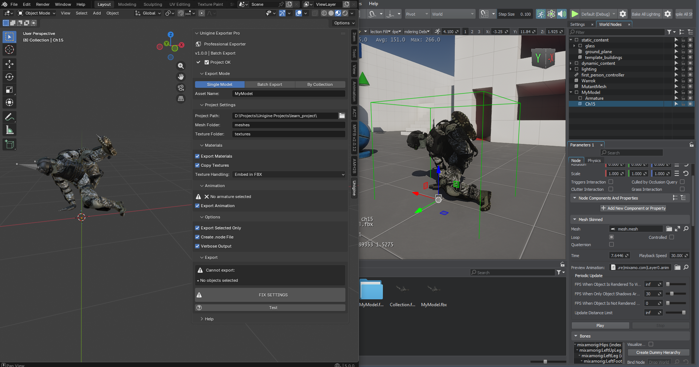

# Unigine Exporter Pro 🚀

**Professional Blender addon for batch exporting models, materials, and animations to the Unigine engine.**

## ✨ Features

- ✅ **Batch export** multiple models at once (Single, Batch, Collection modes)
- ✅ **PBR material support** with automatic texture detection
- ✅ **Skeletal animation** export (baked or raw)
- ✅ **Automatic `.node` file generation** for Unigine
- ✅ **Intelligent texture copying** (`.fbm` and/or `textures/` folder)
- ✅ **Verbose logging** for easy debugging
- ✅ **Works with Unigine 2.19–2.20** and Blender 4.0+

---

## 📸 Screenshots

| Main Panel |
|------------|
[

---

## 🔧 Installation

1. Download the latest release from the [Releases page](https://github.com/yourname/unigine-exporter-pro/releases).
2. In Blender, go to `Edit > Preferences > Add-ons`.
3. Click `Install...` and select the downloaded ZIP file.
4. Enable the addon by checking `Unigine Exporter Pro`.

> **Note:** The addon requires Blender 4.0 or newer.

---

## 🚀 Quick Start

1. **Set your Unigine project path** in the addon panel (sidebar > Unigine).
2. **Select objects** you want to export.
3. **Choose an export mode**:
   - *Single* – one model with a custom name.
   - *Batch* – each selected mesh becomes a separate file.
   - *Collection* – each collection becomes a separate file.
4. **Adjust material & animation settings** as needed.
5. **Click `EXPORT`** and wait for completion.

All exported files will be placed inside your project's `data/` folder with the correct structure:
